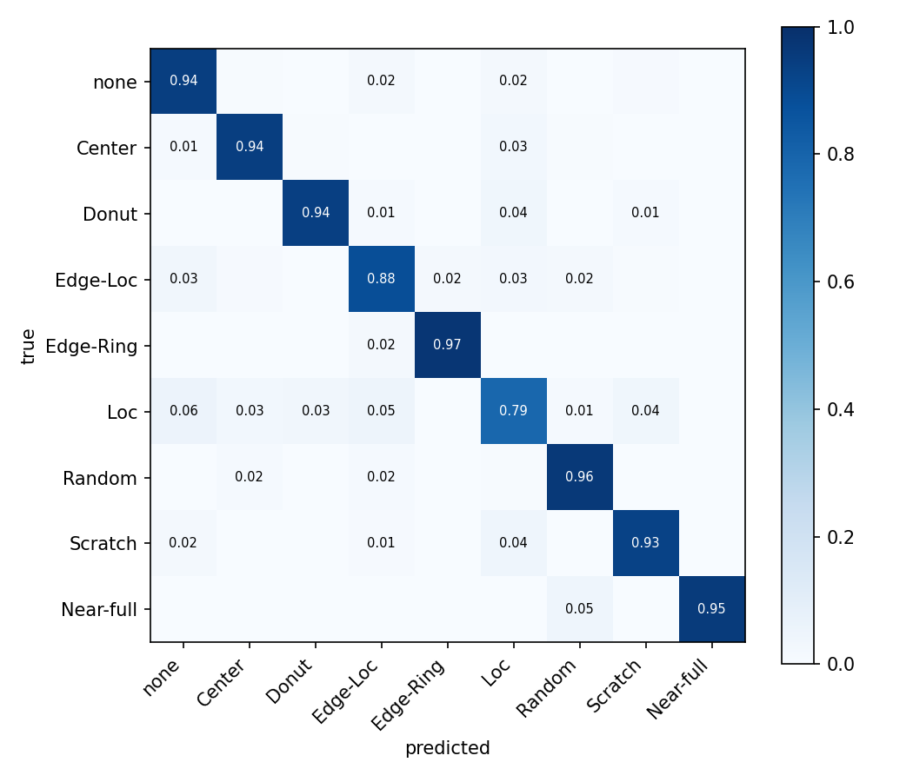
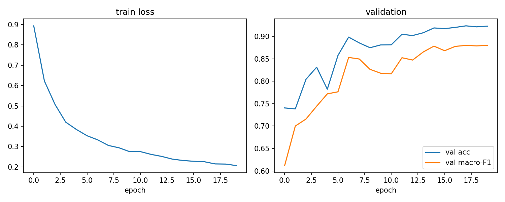

# 웨이퍼맵 불량 패턴 분류 (WM-811K)

반도체 웨이퍼 테스트에서 나오는 웨이퍼맵(다이별 양/불량 지도)을 보고
불량 패턴 유형을 분류하는 CNN 모델입니다.

웨이퍼맵에 나타나는 불량 패턴은 공정 문제와 연결되는 경우가 많습니다.
예를 들어 Edge-Ring 패턴은 열처리 공정 문제, Scratch는 장비 핸들링 문제와
연관된다고 알려져 있어서, 패턴을 자동으로 분류할 수 있으면 불량 원인
추적을 훨씬 빠르게 시작할 수 있습니다. 실제로 공장에서는 이걸 사람이
눈으로 보고 분류하는 경우가 많다고 해서, 자동화해보면 어떨까 싶어
시작한 프로젝트입니다.

## 데이터셋

- [WM-811K](https://www.kaggle.com/datasets/qingyi/wm811k-wafer-map) (Kaggle, LSWMD.pkl 약 2GB)
- 실제 팹에서 수집된 811,457장의 웨이퍼맵
- 이 중 불량 패턴 라벨이 있는 데이터만 사용 (none 포함 9개 클래스)
- 클래스 불균형이 심각함: none이 약 14.7만 장인데 Near-full은 149장

## 폴더 구조

```
├── src/
│   ├── prepare_data.py   # pkl -> npz 변환 (리사이즈, none 샘플링, 분할)
│   ├── dataset.py        # Dataset, 증강, WeightedRandomSampler
│   ├── model.py          # WaferCNN (4개 conv block, 약 30만 파라미터)
│   ├── train.py          # 학습 루프
│   └── evaluate.py       # 테스트셋 평가, confusion matrix
├── tools/
│   └── gen_toy_data.py   # 합성 데이터 생성 (동작 확인용)
├── notebooks/
│   └── wm811k_colab.ipynb  # Colab에서 전체 실험 재현용
└── results/              # 학습 결과물 (모델, 그래프)
```

## 실행 방법

```bash
pip install -r requirements.txt

# 1. Kaggle에서 LSWMD.pkl 받아서 data/ 에 넣기

# 2. 전처리 (64x64 리사이즈, none은 13000장만 샘플링, 70/15/15 분할)
python src/prepare_data.py --pkl data/LSWMD.pkl

# 3. 학습 (GPU 기준 약 10분, CPU면 오래 걸림)
python src/train.py --epochs 20

# 4. 평가
python src/evaluate.py
```

데이터셋 없이 코드 동작만 확인하려면:

```bash
python tools/gen_toy_data.py   # 합성 웨이퍼맵 생성
python src/train.py --smoke    # 1 epoch만
```

GPU가 없으면 `notebooks/wm811k_colab.ipynb`를 Colab에서 열면
데이터 다운로드부터 평가까지 한 번에 돌아갑니다.

## 접근 방법

**전처리**
- 웨이퍼맵 크기가 제각각(작게는 20픽셀대)이라 64x64로 통일
- 값이 0(배경)/1(정상)/2(불량) 3가지뿐이라 보간 시 값이 깨지는 문제가 있어
  nearest 리사이즈 사용 후 3채널 one-hot으로 변환

**클래스 불균형 대응**
- none 클래스를 13,000장으로 캡핑 (전체의 85%를 차지해서 그대로 쓰면
  모델이 none만 찍어도 정확도가 높게 나옴)
- 학습 시 WeightedRandomSampler로 배치 내 클래스 비율 보정
- 90도 단위 회전 + 좌우반전 증강 (웨이퍼는 원형이라 회전해도 패턴
  클래스가 유지됨. Scratch를 15도씩 돌리는 것도 생각해봤는데 보간 문제
  때문에 90도 단위만 사용)
- 모델 선택 기준을 accuracy가 아니라 val macro F1로 설정

**모델**
- 4개 conv block(Conv-BN-ReLU-MaxPool) + GAP + FC, 약 30만 파라미터
- ResNet18 전이학습과 비교했는데 유의미한 차이가 없어서 작은 모델로 확정
  (웨이퍼맵은 ImageNet 같은 자연 이미지와 도메인이 너무 다름)

## 결과

테스트셋 (약 5,700장) 기준:

| 지표 | 값 |
|---|---|
| Accuracy | 0.9275 |
| Macro F1 | 0.8993 |




- 샘플이 적은 Donut, Near-full 클래스가 상대적으로 약함
- Loc과 Edge-Loc 사이 혼동이 가장 많음 (위치 기준이 애매한 경계 케이스가
  실제로 데이터에도 존재)

## 한계와 다음 단계

- 실제 팹 데이터는 두 가지 이상 패턴이 겹친 mixed-type 불량이 존재하는데
  WM-811K 라벨은 단일 패턴만 있음 → multi-label 확장이 필요
- none 캡핑 없이 전체 데이터로 학습하는 실험 (loss 가중치 조정으로)
- 분류를 넘어서 정상 웨이퍼만으로 학습하는 이상 탐지 방식도 시도해보고 싶음

## 참고자료

- Wu et al., "Wafer Map Failure Pattern Recognition and Similarity Ranking
  for Large-Scale Data Sets" (IEEE TSM, 2015) - WM-811K 원 논문
